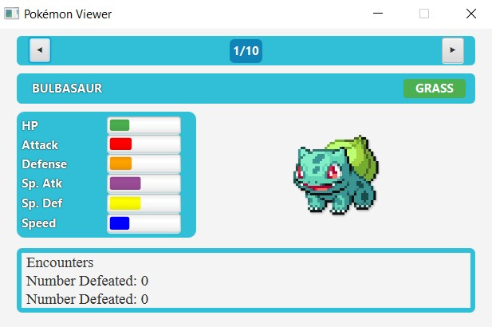
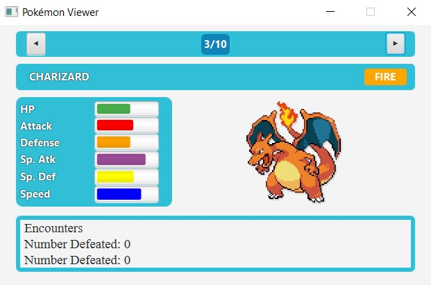

# Pokédex JavaFXML

Este es un proyecto académico desarrollado en Java y JavaFX para la visualización y gestión de datos de Pokémon. El objetivo es crear una Pokédex interactiva utilizando un dataset de Kaggle y una interfaz gráfica construida con JavaFXML.

## Descripción del proyecto

La aplicación carga un conjunto de datos (CSV) con información de múltiples Pokémon y permite al usuario navegar visualmente por ellos. Se muestran estadísticas, tipos, habilidades e imagen de cada Pokémon.

### Componentes principales

- **Interfaz (pantalla JavaFXML)**: desarrollada con FXML y JavaFX, contiene:
  - Labels para nombre, tipo, habilidades y estadísticas.
  - ProgressBars para representar visualmente las estadísticas (HP, Ataque, Defensa, etc.).
  - ImageView para mostrar la imagen del Pokémon.
  - Botones "Anterior" y "Siguiente" para navegar por la Pokédex.
- **Lógica de datos**: clases en Kotlin que gestionan:
  - La carga y representación de Pokémon (`Pokemon`, `PokemonType`, `crearPokemons()`).
  - El controlador (`HelloController`) que actualiza la vista.
  - La clase principal `HelloApplication` que inicia la aplicación.

---

## Tecnologías utilizadas

| Tecnología | Uso |
|------------|-----|
| Kotlin | Lenguaje principal |
| JavaFX | Framework gráfico |
| JavaFXML | Diseño de interfaz |
| Gradle | Gestión de dependencias |

---

## Funcionalidades y características

- Carga de un archivo CSV (`pokemon.csv`) con los datos de los Pokémon.
- Interfaz gráfica para navegar por los Pokémon, con información detallada:
  - Nombre y número del Pokémon.
  - Tipos (uno o dos), con color de fondo según el tipo principal.
  - Lista de habilidades.
  - Estadísticas de combate (HP, Ataque, Defensa, At. Esp., Def. Esp., Velocidad).
  - Imagen del Pokémon.
- Barras de progreso proporcionalmente ajustadas a un valor máximo de 130.
- Navegación por la lista con botones "Anterior" y "Siguiente".
- Aplicación con tamaño de ventana fijo (500×300 píxeles).

---

## Estructura del proyecto

```
files/
    pokemon.csv

src/main/kotlin/
    controller/
        PokemonController.kt
        HelloController.kt
    models/
        Pokemon.kt
        PokemonType.kt
org/itb/
    HelloApplication.kt
resources/
    hello-view.fxml
    imagenes/              ← Imágenes de los Pokémon
```

---

## Instrucciones de instalación y uso

### 1. Clonar el repositorio

```sh
git clone https://github.com/tu-usuario/pokedex-javafxml.git
cd pokedex-javafxml
```

### 2. Preparar el entorno

- Asegúrate de tener instalado Java 17+ y Maven/Gradle o un IDE como IntelliJ IDEA.
- El archivo `pokemon.csv` debe estar en la carpeta `files/`.
- Las imágenes deben estar en `resources/imagenes/` siguiendo el formato que devuelve `getImagePath()`.

### 3. Compilar y ejecutar

Si usas Maven:
```sh
mvn clean javafx:run
```

Si usas Gradle:
```sh
gradle run
```

También puedes ejecutar `HelloApplication.kt` directamente desde el IDE.

---

## Capturas de pantalla

### Vista Pokédex




---

## Créditos

Proyecto realizado por **Agustí López** como parte del módulo de desarrollo de interfaces gráficas con JavaFX. Dataset obtenido de Kaggle e integrado en la aplicación para mostrar información completa de la Pokédex.

---

## Fragmentos de código destacados

**Controlador principal (`HelloController.kt`):**
```kotlin
@FXML private lateinit var lblName: Label
@FXML private lateinit var pokemonImage: ImageView
// … otros controles @FXML …

private fun mostrarPokemons() {
    val pokemon = llistaPokemons[indexActual]
    lblCount.text = "${indexActual+1}/${llistaPokemons.size}"
    lblName.text = pokemon.getName().uppercase()
    // … actualización de estadísticas, barras de progreso, tipo, imagen …
}
```

**Clase principal (`HelloApplication.kt`):**
```kotlin
class HelloApplication : Application() {
  override fun start(stage: Stage) {
    val root = FXMLLoader.load<Parent>(/* ruta FXML */)
    stage.title = "Pokémon Viewer"
    stage.scene = Scene(root, 500.0, 300.0)
    stage.isResizable = false
    stage.show()
  }
}
fun main() = Application.launch(HelloApplication::class.java)
```
